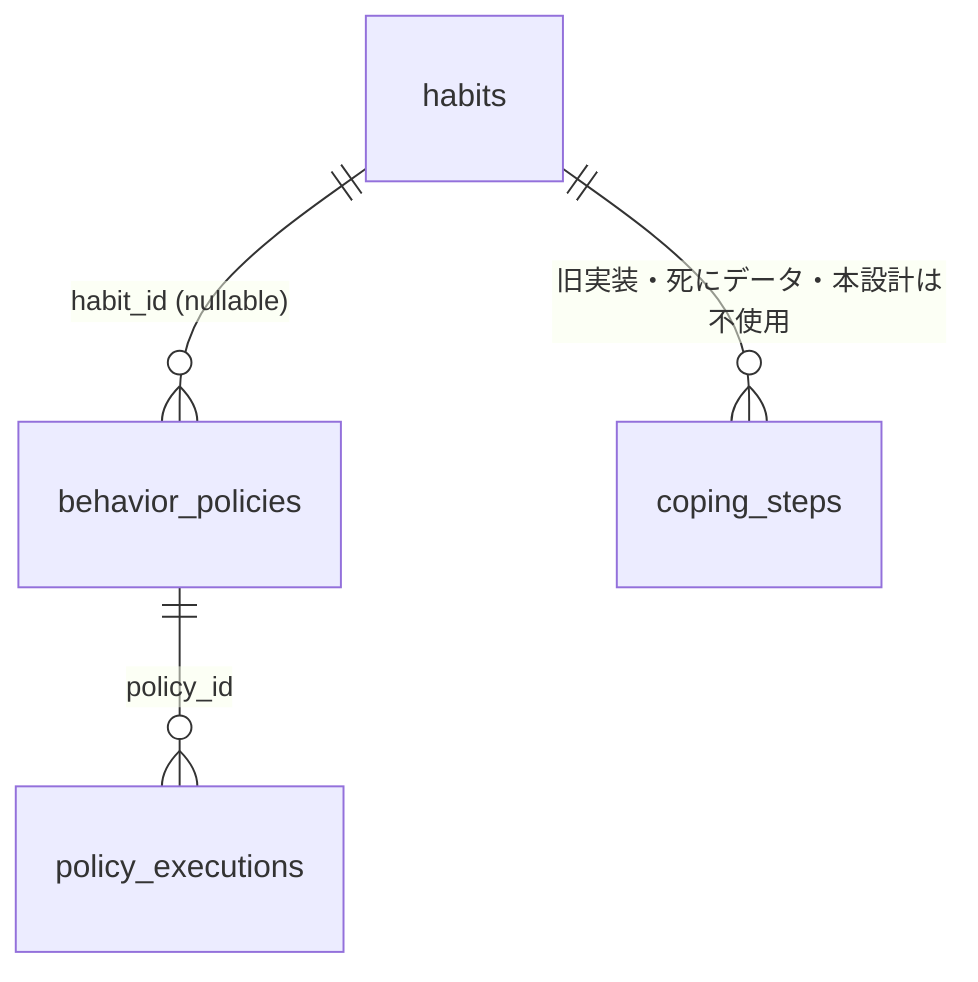

# If-Then ルール（行動指針）設計ドキュメント

- 対応 issue: #28（設計 issue。実装 issue ではない）
- 関連: Refs #4、#86（stats_* 履歴レイヤー。将来接続の余地のみ残し、v1 では依存しない）
- ステータス: 人間レビュー待ち（本ドキュメント承認後に実装 issue を起票する）

## 0. 現状調査の訂正（issue 記載内容のアップデート）

issue #28 は「`if_then` / `policy` / `rule` に相当するドメイン実装はリポジトリ内に一切存在しない（完全な新規機能）」としているが、これは不正確。実際には **If-Then コーピングプランに相当する実装が過去に存在し、撤去された**。

- `supabase/migrations/20260212100000_quit_habits.sql` に `coping_steps`（habit 単位の If-Then ステップ一覧）と `urge_logs`（発動ログ）が定義されている。コメントには「Ordered sub-tasks for quit habits (**if-then coping plan**)」と明記されている。
- 2026-07-16 の `openspec/changes/archive/2026-07-16-redesign-quit-habit-input/` で、この UI（`VsTemptationModal`）とデータ層（`startUrgeFlow` / `completeUrgeStep` / `markQuitDailyDone` / `UrgeLog` 型 / `CopingStep` 型）が**全撤去**された。テーブルは残置（新規書き込み停止・死にデータ、`git grep` で `src/` 配下に `coping_steps` / `CopingStep` / `urge_logs` / `UrgeLog` の参照が 0 件であることを確認済み）。
- 撤去理由（同 design.md より）: 「誘惑が来た瞬間にアプリを開いてコーピングフローをこなす」という前提が実運用に耐えなかった。加えて「誘惑が一度も来なかった完璧な日が達成にならない」という矛盾があった。
- 同 design.md D7 は「`coping_steps` テーブルと既存データは残置し、**復活させる場合は別 issue で設計し直す**」と明記しており、本 issue はまさにその「別 issue」に該当する。

**本設計への含意**: 新機能は旧 `coping_steps` の焼き直しにしない。特に「発動の瞬間にアプリを開かせる誘発型 UX」は再採用しない（1.4 で詳述）。テーブルも新規に切る（1.1 で理由を述べる）。旧テーブル（`coping_steps` / `urge_logs`）は本設計のスコープでは触らない（drop も再利用もしない。死にデータのまま残す）。

---

## 1. 決めること

### 1.1 ルールを習慣に紐付けるか、独立させるか

**結論: 両対応。`habit_id` は nullable な FK にする。**

根拠:

- 旧 `coping_steps` は `habit_id uuid ... not null` で必ず 1 習慣に紐付いていた。しかし If-Then プランニング（implementation intentions）は本来「特定の習慣」だけでなく「怒りを感じたら6秒待つ」のような**汎用の行動指針**も対象にできる手法であり、habit 必須は表現力の制約だった。
- 習慣に紐付けたい場合（「間食したくなったら水を飲む」を quit 習慣の隣に置く）と、紐付けたくない場合（「衝動買いしたくなったら 24 時間待つ」）の両方をユーザーヒアリングなしで排除する理由がない。nullable FK なら両方を 1 テーブルで扱える。

### 1.2 トリガー（If）の表現方法

**結論: 自由入力テキスト（trigger）+ 任意の分類タグ（category、選択式）。**

- 状況の表現は「時刻」「場所」「感情」「先行行動」など軸が多く、初期実装で選択式 UI に固定すると表現力を落とす。旧 `coping_steps.title` も自由入力 text で、ここは実績のあるパターンを踏襲する。
- `category` は `text` 型・nullable・アプリ側で緩い選択肢（例: `emotion` / `time` / `place` / `preceding_action` / `other`）を提示するが DB 側で CHECK 制約は掛けない（将来カテゴリを増減しやすくするため）。フィルタ・並び替えの補助情報という位置づけ。

### 1.3 ルールの達成を記録するか

**結論: 記録する。ただし `habit_completions` とは別テーブル（`policy_executions`）にする。#86 の統計基盤には依存しない。**

- If-Then ルールの発動は「1日1回」に固定できない（1日に複数回衝動が来ることがある）上、`habit_id` が null のルールは `habit_completions`（`habit_id not null`）に書けない。別テーブルが必要。
- #86（`stats_journeys` 等の匿名統計履歴レイヤー）とは概念的に接続しうる（「If-Then ルールをどれだけ実行できたか」を継続性の指標にする）が、#86 はまだ実装されていない size:large 案件で分割設計待ち（2026-07-15 ログ参照）。本設計は #86 の完了を待たずに独立して実装できるようにし、**v1 では `policy_executions` は #86 のテーブルと FK も owner_key も共有しない**。将来接続する場合は #86 側の設計が固まった時点で別途ブリッジ issue を起票する（3 章の任意項目）。

### 1.4 UI をどこに置くか

**結論: 独立ページ（設定内の一覧・編集画面）＋ 習慣詳細に紐づくルールを表示する。「発動を検知してアプリを誘発する」機構は持たない。**

- 0 章の教訓（誘発型モーダルは実運用で機能しなかった）を踏まえ、新機能は**受動的な記録**にする。ユーザーが「今日そのルールを実行できたか」を、衝動が来た瞬間ではなく、後から（アプリを開いたとき・夜の振り返り時など）自己申告的にオン/オフする。
- リアルタイム検知・プッシュ通知は本設計のスコープ外（旧 redesign-quit-habit-input の Non-Goals「通知・リマインダーの追加」を踏襲。同じ理由でここでも明示的に外す）。
- 配置: (a) 設定 or 独立ページで全ルールの一覧・作成・編集・アーカイブ、(b) 習慣詳細画面に `habit_id` が一致するルールをカードで表示し、そこから実行済みチェックを付けられる。汎用ルール（`habit_id` null）は (a) にのみ表示される。

### 1.5 エビデンス記事との関係

**結論: v1 では接続しない。将来拡張候補として issue 一覧（3 章）にのみ残す。**

- If-Then プランニング自体の効果量エビデンスを記事として見せる余地はあるが、既存の `evidences` は `habit.impactArticleId` / `HabitEvidence` ベースで habit 単位に紐づく設計であり、ポリシー単位（habit 非依存もありうる）の表示は別軸のデータモデルが要る。スコープを広げすぎないよう、本設計では扱わない。

---

## 2. テーブル定義（SQL 骨子）

マイグレーション実装レベルの精緻さは求めず、主要カラム・型・FK・制約の骨子のみ示す。命名・RLS パターンは `user_profiles`（`supabase/migrations/20260612010000_user_profiles.sql`）の分割ポリシー（select/insert/update を個別に定義）を踏襲し、旧 `coping_steps` の「habit 所有権経由の ALL 一括ポリシー」は使わない（`habit_id` が null になりうるため habit 経由の権限委譲が成立しない）。

```sql
-- ============================================
-- Table: behavior_policies
-- If-Then 行動指針（habit_id は任意。汎用ルールも許容）
-- ============================================
create table public.behavior_policies (
  id uuid primary key default gen_random_uuid(),
  user_id uuid not null references auth.users(id) on delete cascade,
  habit_id uuid references public.habits(id) on delete set null,
  trigger_text text not null check (char_length(trigger_text) between 1 and 200),
  action_text text not null check (char_length(action_text) between 1 and 200),
  category text,
  archived boolean not null default false,
  sort_order integer not null default 0,
  created_at timestamptz not null default now(),
  updated_at timestamptz not null default now()
);

alter table public.behavior_policies enable row level security;

create policy "Users can view own policies"
  on public.behavior_policies for select
  to authenticated
  using (auth.uid() = user_id);

create policy "Users can insert own policies"
  on public.behavior_policies for insert
  to authenticated
  with check (auth.uid() = user_id);

create policy "Users can update own policies"
  on public.behavior_policies for update
  to authenticated
  using (auth.uid() = user_id)
  with check (auth.uid() = user_id);

create policy "Users can delete own policies"
  on public.behavior_policies for delete
  to authenticated
  using (auth.uid() = user_id);

create index idx_behavior_policies_user on public.behavior_policies(user_id, archived, sort_order);
create index idx_behavior_policies_habit on public.behavior_policies(habit_id) where habit_id is not null;

-- ============================================
-- Table: policy_executions
-- ルール実行の自己申告ログ（1 ルールにつき 1 日複数回もありうるため
-- policy_id + date のユニーク制約は課さない）
-- ============================================
create table public.policy_executions (
  id uuid primary key default gen_random_uuid(),
  policy_id uuid not null references public.behavior_policies(id) on delete cascade,
  user_id uuid not null references auth.users(id) on delete cascade,
  executed_on date not null,
  note text,
  created_at timestamptz not null default now()
);

alter table public.policy_executions enable row level security;

create policy "Users can view own policy executions"
  on public.policy_executions for select
  to authenticated
  using (auth.uid() = user_id);

create policy "Users can insert own policy executions"
  on public.policy_executions for insert
  to authenticated
  with check (auth.uid() = user_id);

create policy "Users can delete own policy executions"
  on public.policy_executions for delete
  to authenticated
  using (auth.uid() = user_id);

create index idx_policy_executions_policy_date on public.policy_executions(policy_id, executed_on);
create index idx_policy_executions_user_date on public.policy_executions(user_id, executed_on);
```

### 型・アクセス層の配置方針（既存パターン踏襲）

- 型定義: `src/types/habit.ts` に `BehaviorPolicy` / `PolicyExecution` を追加（`CopingStep` は既に削除済みなので新規追加のみで衝突しない）。
- アクセス層: `src/lib/supabase/policies.ts`（新規ファイル）に `PolicyRow` → `toBehaviorPolicy()` の camelCase 変換パターンを実装（`src/lib/supabase/profiles.ts` の Row/domain 分離パターンを踏襲）。
- 純粋ロジック（並び替え・カテゴリ集計など）は `src/lib/policies.ts` に分離し DB I/O を持たせない（`src/lib/profile-settings.ts` の規約に合わせる）。

### 既存モデルとの関係



| テーブル | 状態 | 本設計との関係 |
|---|---|---|
| `coping_steps` / `urge_logs` | 死にデータ（読み書きコード撤去済み） | 触らない。再利用も drop もしない |
| `habits` | 現行 | `behavior_policies.habit_id` の任意参照先 |
| `habit_completions` | 現行 | 使わない。ルール実行ログは `policy_executions` に分離 |
| `stats_journeys`（#86、未実装） | size:large・分割設計待ち | v1 では接続しない。将来ブリッジ issue の対象候補（3 章） |

---

## 3. 切り出す実装 issue 一覧

承認後、以下を目安に実装 issue を起票する（タイトル案・粒度・依存関係）。

1. **`behavior_policies` / `policy_executions` マイグレーション + 型 + アクセス層**（中）
   本ドキュメントの SQL 骨子を実装レベルに落とす。RLS のテスト（他ユーザーの行が見えない・書けない）を含む。
2. **設定内の独立ページ（一覧・作成・編集・アーカイブ）**（中・issue 1 に依存）
   汎用ルール（`habit_id` null）を含めた CRUD UI。
3. **習慣詳細画面への紐づくルール表示 + 実行済みチェック**（小〜中・issue 1, 2 に依存）
   `habit_id` が一致する `behavior_policies` をカード表示し、`policy_executions` への insert/delete で実行済みをトグルする。
4. **（任意・低優先度）#86 統計基盤との接続**（#86 の分割設計確定後に着手判断）
   #86 が実装された後、ルール実行の継続性を匿名統計レイヤーに接続するかを再検討する。v1 のスコープ外。

issue 1 が基盤（データ層）、2〜3 が UI 層という順序で着手するのが自然。issue 4 は #86 側の状況待ちのため、本設計の承認だけでは起票しない。
