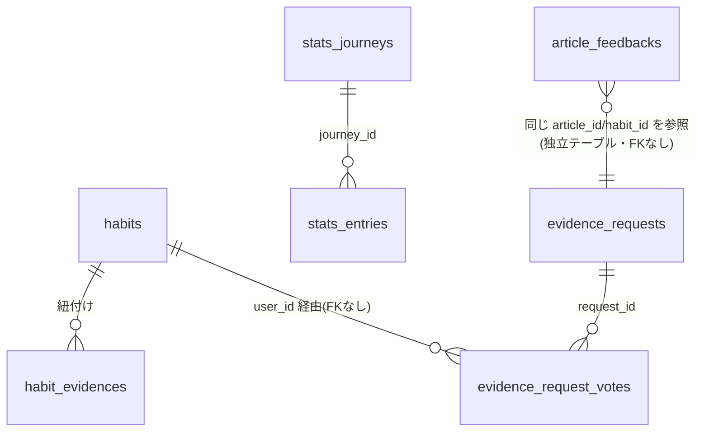

# 投票権システム 設計ドキュメント

- 対応 issue: #27（設計 issue。実装 issue ではない）
- 関連: #86（stats_* 履歴レイヤー）, #89（構造化投票 article_feedbacks）, #90（エビデンスリクエスト evidence_requests）
- ステータス: 人間レビュー待ち（本ドキュメント承認後に実装 issue を起票する）

## 0. 位置づけ

#89・#90 は「コミュニティ機能なしの手動運転版」としてすでに切り出されている。

- #89: エビデンス記事への 4 択投票（効果が過大/過小/妥当/間違い）。1 ユーザー 1 記事 1 票、無重み。
- #90: エビデンス未紐付けの習慣に対する「エビデンスをリクエスト」機能。単純な件数で運営が週次判断。

本ドキュメントが設計するのは、この 2 つの上に載る **「誰がどれだけの重みで、何に投票できるか」** の仕組み（投票権の獲得・配分・消費）である。#89・#90 のテーブル・RLS・UI はそのまま維持し、投票権システムは重み計算のレイヤーを追加するだけに留める。

---

## 1. 決めること

### 1.1 投票権の獲得条件

**結論: 継続日数（streak）ベースを主軸にする。記録の量（チェック回数）や課金額は投票権の直接の獲得源にしない。**

根拠:

- 記録の量（完了チェックの回数）をそのまま重みにすると「多くチェックするほど投票権が強くなる」構造になり、虚偽記録を誘発する（1.4 参照）。stats_entries のような完了ログの件数は使わない。
- 課金額を投票権の直接の獲得源にすると「金で評価結果を買える」構造になり、エビデンスの信頼性という商品価値そのものを毀損する。`subscriptions` / `founding_memberships` の存在は認知するが、v1 では投票の可否・重みの計算に一切関与させない（無料ユーザーでも継続日数さえあれば同条件で投票できる）。
- 継続日数は「同じ習慣を実際に一定期間やり続けた」という、チェックボックス連打より操作コストの高い事実であり、#86 の `stats_journeys` がまさに journey 単位の継続を履歴として保持する設計になっている。新たな状態管理を増やさずにこれを再利用できる。
- #89 の受け入れ条件に「投票時に投票者の継続日数をスナップショット保存する」がすでに含まれており、重みの原資が継続日数であることは先行 issue の時点で前提化されている。本設計はこれと整合させる。

v1 の具体条件:

- 投票権 = 「投票対象のエビデンス記事に紐づく習慣を、投票者が現在進行中の journey として何日継続しているか」の関数（算出方法は 1.3）。
- 継続日数 7 日未満（その習慣をまだ十分に使っていない）のユーザーは重み付き投票の対象外とする。「使ってもいない習慣の効果を評価できない」という原則。
- 課金はゲート条件にしない。将来リクエスト機能側の表示優先度ブースト等に使う余地は残すが、本設計のスコープ外（1.6 参照）。

### 1.2 投票権の消費先

**結論: 「リクエストへの投票」（#90 の `evidence_requests`）と「効果数値の補正」（#89 の `article_feedbacks.verdict`）の両方に効かせる。ただし性質が異なる。**

- **リクエストへの投票**: 「次にどの習慣のエビデンスを作るか」の優先度づけ。単純な件数だと「声の大きい人が多い習慣」が勝ちやすいため、重み付き投票にして「実際に継続して頑張っている人の声」を優先する。新規テーブル `evidence_request_votes` を追加する（2 章）。
- **効果数値の補正**: #89 は無重みの 4 択投票を先に実装する（1 ユーザー 1 票のフラットカウント）。投票権システムはこの集計に重みを掛けた**別ビュー**を追加するだけで、`article_feedbacks` 本体・既存の `article_feedback_stats`（無重みビュー）は変更しない。無重み集計と重み付き集計を両方見比べられる状態を維持する。

根拠: 受け入れ条件が「リクエストへの投票か、効果数値の補正か、その両方か」を問うており、両方を採用する方が #89・#90 の資産をそのまま活かせる。新しい投票対象を作らずスコープを絞れる。

### 1.3 重み付けの根拠

**結論: 継続日数の階段関数（tier）で重みを決める。対数関数のような連続関数ではなく、UI で説明しやすい 3 段階の整数倍率にする。**

| 継続日数 | 重み |
|---|---|
| 0〜6 日 | 投票不可（0） |
| 7〜29 日 | 1 |
| 30〜89 日 | 2 |
| 90 日以上 | 3 |

根拠: 連続関数（対数等）は「あなたの投票権は何倍か」を UI で素直に説明しにくい。階段関数は「続けるほど段階的に強くなる」という直感的なメッセージになり、かつ上限（3 倍）があるので一人のヘビーユーザーが集計を支配しすぎない。

**継続日数の算出元**: #86 の `stats_journeys`（`journey_id, article_id, owner_key, started_on, ended_on`）を使う。投票時点で該当 `article_id` に紐づく進行中 journey（`ended_on is null`）の `started_on` から起算した日数を streak とする。

**課題: 匿名 `owner_key` と投票（`user_id` ベース）をどう橋渡しするか。**
`stats_journeys` は #86 の設計原則により `user_id` を持たない（匿名統計の完全性を守るため）。一方で投票は「本人が自分の継続日数を主張する」文脈なので `user_id` スコープが必要になる。この橋渡しのため、`user_id` と `habit_id` から `owner_key` を**決定論的かつ一方向**に再計算する共有関数 `stats_owner_key(user_id, habit_id)` を導入する（2 章）。

- 一方向ハッシュなので、`owner_key` から `user_id` を逆算することはできない（`stats_journeys` 側の匿名性は壊れない）。
- 本人が自分の `user_id` + `habit_id` を渡して自分の `owner_key` を再計算し、`stats_journeys` と突き合わせるのは security definer 関数内でのみ許可する（クライアントに `stats_journeys` への直接 select 権限は与えない。#86 の「クライアント直接読み書き不可」方針を継承）。
- この関数は #86 が `stats_journeys` に書き込む際の `owner_key` 生成ロジックと**同一アルゴリズムでなければならない**。#86 実装時にこの関数をそのまま採用してもらう前提で、本ドキュメントを契約として扱う（実装 issue 一覧の #1 参照）。

### 1.4 ゲーミフィケーションの副作用（虚偽記録・不正投票）への対策

対策は複数用意する（受け入れ条件は「最低 1 つ」だが、単一の対策では抜け穴が残るため以下をセットで採用する）。

1. **重みの上限を低く抑える（tier 上限 3 倍）**: 仮に虚偽記録で streak を稼いでも、得られる投票権の増分は最大 3 倍で頭打ちになる。無限に強くなる設計を避けることで「稼ぐ動機」自体を弱める。
2. **重みは journey 単位・記事単位でのみ有効**: 重みはその journey に対応する `article_id` への投票にしか使えない。習慣を大量に作って streak を稼いでも、各習慣ごとに streak がゼロから積み上がるだけで、他の記事への投票権を底上げすることはできない（「幅広く投票権を持つ」実利が薄い）。
3. **チェック密度ではなく journey の経過日数のみを見る**: `stats_entries`（日々の完了ログ）の件数は重み計算に一切使わない。1 日に何度チェックしても streak は伸びない。streak が伸びるのは journey の `started_on` からの暦日経過のみであり、チェックのスパムでは重みを稼げない。
4. **多重投票対策**: `article_feedbacks` は既に `(user_id, article_id)` 一意（#89 の受け入れ条件「1 ユーザー 1 記事 1 票、変更可」）。`evidence_request_votes` も `(request_id, user_id)` 一意制約を課す（2 章）。複数アカウントによる物量作戦の自動検知は v1 のスコープ外とし、`article_feedback_stats` / `evidence_request_weighted_stats` ビューを見た運営の目視判断に委ねる。
5. **weight・streak はクライアントの自己申告を信用しない**: 投票 RPC (`cast_evidence_request_vote`) が `auth.uid()` から server 側で streak を再計算し、weight を算出する。クライアントから weight や streak 値を直接書き込む経路は与えない（`evidence_request_votes` に対する INSERT/UPDATE の RLS ポリシーをクライアントに開放しない。2 章）。

対策 2 の残課題として、「エビデンス付け替えを繰り返して journey を延命させる」濫用は理論上残る（#86 の設計上、付け替え時に旧 journey を閉じ新 journey を開始するため、頻繁な付け替え自体は streak をリセットする方向に働き旨味が薄いが、完全には潰し切れない）。v1 では実装対策を取らず、運用ログでの異常検知に留める（実装 issue 化しない。将来必要になれば別 issue で対応）。

### 1.5 コミュニティ機能をどこまで持つか

**結論: v1 は非公開。他人の個票・投票者名・投票者の streak は見せない。集計値（重み付きスコア）のみ見せる。**

根拠:

- `article_feedbacks` の既存 RLS は「自分の行のみ select 可能」。投票権システムもこれを踏襲し、`evidence_request_votes` の select ポリシーも「自分の投票のみ」とする。
- 集計は `service_role` 経由のビュー（`article_feedback_weighted_stats` / `evidence_request_weighted_stats`）でのみ提供する。ユーザー向けには「この記事は妥当判定が◯%」「このリクエストは現在◯ポイント」のような集計サマリの表示余地は残すが、UI 実装は #89・#90 側の後続 issue の範囲であり、本設計は集計の元データを用意するところまでに責任を持つ。
- 個人の streak・投票内容を他人に公開しないのは、#86 の匿名化原則（削除バイアスの構造的排除、退会後もデータが残ることへの配慮）と一貫させるため。

v1 で持たないもの: いいね欄、投票者ランキング、投票コメントへの返信スレッド。

### 1.6 手動運転から自動化への移行境界

- **記事の作成・再調整自体は自動化しない**: evidence-pipeline スキルによる記事執筆・再調整案の生成は、投票権システム導入後も「人間レビュー → 反映」のループを維持する（#89 の備考どおり）。
- **自動化するのは「重み付き集計値の算出」まで**: どの習慣を優先すべきか（evidence_request_weighted_stats の並び順）、どの記事の verdict が偏っているか（article_feedback_weighted_stats）は自動的に数値化される。この数値を見て「どうするか」を判断するのは引き続き運営（人間 + LLM 補助）。
- **将来自動化してよい候補（optional・低優先度）**: 重み付き集計値が閾値を超えたら「要見直し記事」に自動タグ付けして運営に通知する程度は自動化候補になり得る（実装 issue 一覧の任意項目として記載。承認前の想定であり必須ではない）。
- **自動化しない境界**: 「集計結果をそのまま記事本文に自動反映する」ことは対象外とする。数値の当落を人間の目を通さずに公開へ反映する経路は作らない（安全装置として人間レビューを外さない）。

---

## 2. テーブル定義（SQL 骨子）

マイグレーション実装レベルの精緻さは求めず、主要カラム・型・FK・制約の骨子のみ示す。

```sql
-- =========================================================
-- stats_owner_key: user_id + habit_id → 匿名 owner_key への
-- 決定論的・一方向変換。#86 の stats_journeys 書き込み時と
-- 同一アルゴリズムを共有する契約関数（実装 issue #1 参照）。
-- =========================================================
create or replace function public.stats_owner_key(p_user_id uuid, p_habit_id uuid)
returns text
language sql
immutable
as $$
  select encode(digest(p_user_id::text || ':' || p_habit_id::text, 'sha256'), 'hex')
$$;

-- =========================================================
-- get_voter_streak_days: 投票者本人(auth.uid())の、指定記事に
-- 紐づく進行中 journey の継続日数を返す。security definer で
-- stats_journeys への直接 select 権限をクライアントに与えない。
-- =========================================================
create or replace function public.get_voter_streak_days(p_article_id text)
returns integer
language plpgsql
security definer
set search_path = public
as $$
declare
  v_days integer;
begin
  select coalesce(max(current_date - j.started_on), 0)
  into v_days
  from public.habit_evidences he
  join public.habits h on h.id = he.habit_id
  join public.stats_journeys j
    on j.owner_key = public.stats_owner_key(h.user_id, h.id)
   and j.article_id = p_article_id
   and j.ended_on is null
  where h.user_id = auth.uid()
    and he.article_id = p_article_id;

  return v_days;
end;
$$;

-- =========================================================
-- evidence_request_votes: #90 の evidence_requests に対する
-- 重み付き投票。weight / streak はクライアントから直接書けない
-- （RPC 経由のみ）。
-- =========================================================
create table if not exists public.evidence_request_votes (
  id uuid primary key default gen_random_uuid(),
  request_id uuid not null references public.evidence_requests(id) on delete cascade,
  user_id uuid not null references auth.users(id) on delete cascade,
  weight smallint not null check (weight between 1 and 3),
  streak_days_snapshot integer not null check (streak_days_snapshot >= 0),
  created_at timestamptz not null default now(),
  unique (request_id, user_id)
);

alter table public.evidence_request_votes enable row level security;

-- select: 自分の投票のみ（1.5 非公開方針）
create policy "Users can view own request votes"
  on public.evidence_request_votes for select
  using (auth.uid() = user_id);

-- insert/update の直接クライアント経路は用意しない。
-- 書き込みは security definer 関数 cast_evidence_request_vote 経由のみ。

-- =========================================================
-- cast_evidence_request_vote: 重み付き投票の唯一の書き込み経路。
-- streak・weight を server 側で再計算してから upsert する
-- （1.4 対策 5）。
-- =========================================================
create or replace function public.cast_evidence_request_vote(p_request_id uuid, p_article_id text)
returns void
language plpgsql
security definer
set search_path = public
as $$
declare
  v_days integer;
  v_weight smallint;
begin
  v_days := public.get_voter_streak_days(p_article_id);

  if v_days < 7 then
    raise exception 'insufficient streak to vote (min 7 days continuous journey required)';
  end if;

  v_weight := case
    when v_days >= 90 then 3
    when v_days >= 30 then 2
    else 1
  end;

  insert into public.evidence_request_votes (request_id, user_id, weight, streak_days_snapshot)
  values (p_request_id, auth.uid(), v_weight, v_days)
  on conflict (request_id, user_id)
  do update set
    weight = excluded.weight,
    streak_days_snapshot = excluded.streak_days_snapshot,
    created_at = now();
end;
$$;

-- =========================================================
-- evidence_request_weighted_stats: リクエストの優先度ビュー
-- （service_role 経由。運営の週次判断で使う）
-- =========================================================
create or replace view public.evidence_request_weighted_stats as
select
  request_id,
  sum(weight) as weighted_score,
  count(*) as raw_votes,
  max(created_at) as last_voted_at
from public.evidence_request_votes
group by request_id;

-- =========================================================
-- article_feedback_weighted_stats: #89 で article_feedbacks に
-- 追加される verdict / voter_streak_days を前提にした重み付き
-- 集計ビュー。article_feedbacks 本体・既存の無重み
-- article_feedback_stats ビューは変更しない。
-- =========================================================
create or replace view public.article_feedback_weighted_stats as
select
  article_id,
  verdict,
  sum(case
    when voter_streak_days >= 90 then 3
    when voter_streak_days >= 30 then 2
    when voter_streak_days >= 7  then 1
    else 0
  end) as weighted_votes,
  count(*) as raw_votes
from public.article_feedbacks
where verdict is not null
group by article_id, verdict;
```

### stats_* / article_feedbacks との関係



| テーブル / 関数 | 所属 issue | 役割 | 投票権システムとの関係 |
|---|---|---|---|
| `stats_journeys` | #86 | journey 単位の継続履歴（匿名 `owner_key`） | `get_voter_streak_days()` が `owner_key` 経由で参照する、streak の唯一の情報源。直接 FK は張らず `stats_owner_key()` の計算結果で突き合わせる |
| `stats_entries` | #86 | 日次入力ログ | 重み計算には使わない（1.4 対策 3）。将来「入力密度」を別軸で使う拡張余地としてのみ残す |
| `article_feedbacks`（`verdict`, `voter_streak_days`） | #89 | 4 択投票＋継続日数スナップショット | 本設計はこのテーブルを変更しない。読み取り専用の `article_feedback_weighted_stats` ビューを追加するのみ |
| `evidence_requests` | #90 | エビデンスリクエスト（習慣単位） | `evidence_request_votes` の親。1 リクエストに複数の重み付き投票がぶら下がる |
| `evidence_request_votes`（新規） | #27（本設計） | リクエストへの重み付き投票 | 本 issue の中心的な新規テーブル |
| `stats_owner_key()` / `get_voter_streak_days()` / `cast_evidence_request_vote()`（新規） | #27（本設計、`stats_owner_key` は #86 と契約共有） | 匿名統計レイヤーと `user_id` ベースの投票を安全に橋渡しする | #86 実装時に `stats_owner_key` のアルゴリズムを合わせる必要がある（実装 issue #1） |

---

## 3. 切り出す実装 issue 一覧

承認後、以下を目安に実装 issue を起票する（タイトル案・粒度・依存関係）。

1. **`stats_owner_key` 関数の実装と #86 との整合確認**（小・#86 に依存）
   `stats_owner_key(user_id, habit_id)` を #86 のマイグレーションに含める、または #86 実装後に追加し、`stats_journeys` 書き込み時の `owner_key` 生成と同一アルゴリズムであることをテストで担保する。
2. **`evidence_request_votes` テーブル + `get_voter_streak_days` / `cast_evidence_request_vote` RPC のマイグレーション**（中・#86, #90, issue 1 に依存）
   本ドキュメントの SQL 骨子を実装レベルに落とす。RLS・RPC のテスト（streak 不足で reject、weight tier の境界値、upsert の冪等性）を含む。
3. **`article_feedback_weighted_stats` ビューの追加**（小・#89, issue 1 に依存）
   #89 が `verdict` / `voter_streak_days` カラムを実装した後、重み付き集計ビューを追加する。
4. **エビデンスリクエスト管理画面（運営向け）に重み付きスコアを表示**（小〜中・issue 2 に依存）
   `evidence_request_weighted_stats` を `weighted_score` 降順で表示し、週次の evidence-pipeline 対象選定に使う。
5. **記事詳細シートに「あなたの投票権（streak tier）」を表示**（小・issue 1, 2 に依存）
   ユーザーに自分の重みを見せる透明性 UI。tier の閾値（7/30/90 日）を UI 文言に反映。
6. **（任意・低優先度）異常な習慣付け替え頻度のモニタリング**（小・issue 2 に依存）
   1.4 の残課題（journey 延命による濫用）を運用ログから検知する。v1 必須ではなく、濫用が実際に観測されてから着手を判断する。
7. **（任意・低優先度）重み付き集計値の閾値超えで「要見直し記事」を自動タグ付け**（小・issue 3 に依存）
   1.6 で述べた自動化候補。記事本文への自動反映は行わず、運営への通知に留める。

issue 1〜3 が基盤（データ層）、4〜5 が UI 層、6〜7 は運用改善の任意項目という順序で着手するのが自然。
